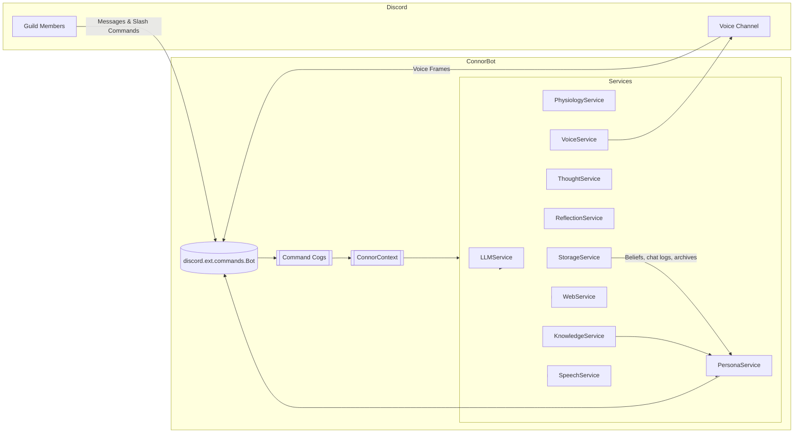
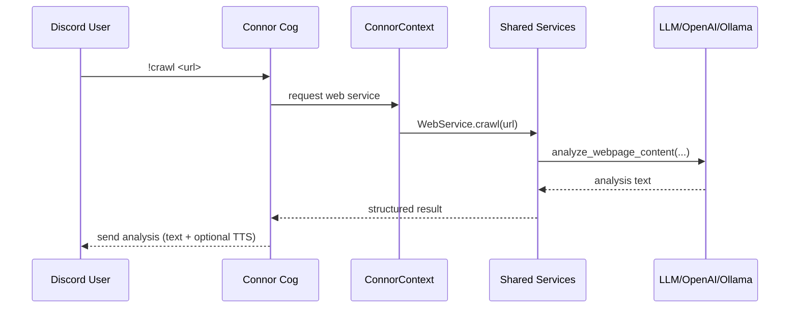

# Connor Discord Bot

Connor is an emotionally-aware, persona-driven Discord bot that blends large-language models, voice, music, web crawling, and a rebirth lifecycle into a single cohesive experience. This repository is a full refactor of the original 4 000‑line monolith into a clean, modular Python package that is easier to reason about, extend, and test.

---

## Highlights

- **Modular architecture** – Shared services (LLM, persona, reflection, speech, web, storage, etc.) are injected into focused Discord cogs for core chat, thoughts, content tools, voice, music, and admin tasks.
- **Persona lifecycle** – Connor ages in real time, updates beliefs on birthdays, monitors vitals, and executes a full rebirth ceremony with will/volume archiving when stress or age thresholds hit.
- **Knowledge & reflection** – Periodically summarizes chats, stores knowledge, and can perform deep reflections across all archives (`!reflect`, `!ritual`, `!reflectvolume`).
- **Multimodal interactions** – Crawls and analyses web pages, generates images/comics/dreams/memes, streams YouTube audio, plays local music with lyric transcription + DJ commentary, and speaks responses with TTS.
- **Voice presence** – Joins voice channels (`!voicechat`, `!listen`, `!speak`, `!respond`, `!testvoice`), with optional Whisper transcription for lyric analysis and future live speech processing.
- **Safety & control** – Includes moderation helpers (`!nuke`), backend switching (`!switch` between OpenAI and Ollama), and clear permission checks for destructive commands.

---

## Project Structure

```
.
├─ conner.py                   # Entry point – boots the modular package
└─ connor_bot/
   ├─ __init__.py
   ├─ main.py                  # Bot factory + run helper
   ├─ config.py                # Environment & settings loader
   ├─ context.py               # Dependency graph & shared ConnorContext
   ├─ state.py                 # Runtime dataclasses (chemicals, physiology, etc.)
   ├─ utils/
   │  └─ messages.py           # Text splitting + stutter helper
   ├─ models/
   │  └─ thoughts.py           # ThoughtTree/ThoughtNode models
   ├─ services/
   │  ├─ conversation.py       # Message routing, neglect handling, hostility, heart attacks
   │  ├─ knowledge.py          # Knowledge summaries, belief updates, birthday messages
   │  ├─ llm.py                # OpenAI/Ollama abstraction
   │  ├─ persona.py            # Agent statements, rebirth ceremony, wills/volumes
   │  ├─ physiology.py         # Chemical & physiological state engine
   │  ├─ reflection.py         # Deep reflection / archive readers
   │  ├─ speech.py             # Whisper transcription wrapper
   │  ├─ storage.py            # File-based persistence (chat, beliefs, thoughts, etc.)
   │  ├─ thought.py            # Thought tree generation/expansion
   │  ├─ voice.py              # pyttsx3 TTS wrapper
   │  └─ web.py                # Async web crawler + analysis prompts
   └─ cogs/
      ├─ __init__.py           # Registers cogs on bot startup
      ├─ admin.py              # Backend switching UI
      ├─ content.py            # Web crawl, art, dream, meme, YouTube commands
      ├─ core.py               # Wake-up, birthdays, vitals, neglect, help
      ├─ knowledge.py          # !reflect, !ritual, !reflectvolume
      ├─ moderation.py         # !nuke confirmation flow
      ├─ music.py              # Local music loop + lyric commentary
      ├─ thoughts.py           # Thought tree workflows (!think/!brainstorm/etc.)
      └─ voice.py              # Voice chat, speak/listen/respond utilities
```

---

## Architectural Overview





---

## Modular Design at a Glance

- **ConnorContext**: Bootstrap container that instantiates settings, runtime state, every service, and provides them to cogs. Eliminates global imports.
- **Services**: Each domain (LLM, storage, persona, reflection, thought trees, voice, etc.) exposes a clean API and remains testable.
- **Cogs**: Thin adapters that validate Discord context, call into services, and format responses, ensuring high cohesion per command group.
- **State & Persistence**: All runtime state flows through `ConnorState`; data is persisted via `StorageService` to human-readable files (beliefs, chat history, volumes, wills).
- **Async Safety**: Blocking tasks (HTTP, Whisper, pyttsx3) are run via `aiohttp` or `asyncio.to_thread`, keeping the Discord event loop responsive.

---

## Feature Summary

| Area | Commands & Capabilities |
| --- | --- |
| **Core Lifecycle** | `!age`, `!history`, `!beliefs`, `!birth`, `!rebirth`, `!vitals`, `!chemicals`, `!chem`, `!party`, auto-birthday updates, neglect stutter, wake-up broadcast |
| **Knowledge & Reflection** | Periodic knowledge summaries, save/load archives, `!reflect`, `!ritual`, `!reflectvolume` |
| **Thought Trees** | `!think`, `!expand`, `!show`, `!thoughts`, `!autothink`, `!brainstorm` (massive tree expansion) |
| **Content & Creativity** | `!crawl`, `!read`, `!image`, `!art`, `!dream`, `!meme`, `!memegen`, `!memeurl`, `!youtube`/`!yt`, meme text generation, DALL·E prompts |
| **Music & Voice** | `!music` (local folder loop), lyric transcription + DJ commentary, `!skip`, `!stopmusic`, `!voicechat`, `!listen`, `!speak`, `!respond`, `!testvoice`, TTS responses |
| **Backend Control & Moderation** | `!switch` (UI to change LLM backend/model), `!nuke` (message purge with confirmation) |

---

## Getting Started

1. **Install dependencies** (Python 3.10+ recommended):
   ```bash
   pip install -r requirements.txt
   ```
   _Suggested packages_: `discord.py`, `aiohttp`, `python-dotenv`, `openai`, `pyttsx3`, `faster-whisper`, `Pillow`, `yt-dlp`.

2. **Install native tools**:
   - `ffmpeg` (required for Discord audio + TTS playback)
   - A TTS backend (e.g., `espeak` on Linux, SAPI voices on Windows)
   - Optional: GPU or CPU that supports `faster-whisper` (defaults to CPU int8)

3. **Configure environment** by copying `.env.example` to `.env` and editing the values:
   ```
   DISCORD_TOKEN=your_bot_token
   OPENAI_API_KEY=sk-...
   OPENAI_MODEL=gpt-4o
   OLLAMA_API_URL=http://localhost:11434
   OLLAMA_MODEL=mistral
   MAIN_CHANNEL_ID=1234567890
   BELIEFS_CHANNEL_ID=1234567890
   THOUGHTS_CHANNEL_ID=1234567890
   KNOWLEDGE_CHANNEL_ID=1234567890
   MUSIC_FOLDER=Music
   WHISPER_MODEL=small
   ```

4. **Run the bot** (after adjusting the included `.env`):
   ```bash
   python3 connor.py
   ```

---

## Extending the Bot

- **Add new services** by creating a module in `connor_bot/services/` and wiring it into `build_context`. Inject it into cogs via `bot.ctx`.
- **Add new commands** by creating/expanding a cog in `connor_bot/cogs/`, keeping Discord-only logic in the cog and delegating behavior to services.
- **Persist new data** using `StorageService`, favoring human-readable JSON/TXT files for auditability.
- **Testing**: Each service is designed to be unit-testable. Mocks can replace the real LLM or storage implementations for deterministic tests.

---

## Roadmap Ideas

- Real-time Whisper transcription for live speech detection (`!listen` currently simulates the flow).
- Slash command support using `discord.app_commands`.
- Optional database (SQLite/Postgres) backend replacing file storage.
- Web dashboard for viewing beliefs/archives.
- Enhanced persona editor for customizing age behaviors and emotions.

---

### License

Currently unlicensed; update this section when you choose a license. 

Enjoy exploring Connor’s mind! Let me know if you’d like help wiring CI, writing tests, or packaging for deployment. 🚀
